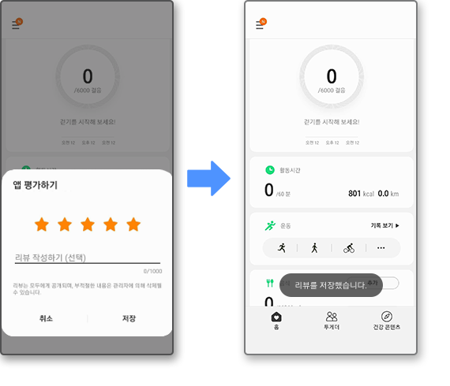

# galaxy_store_in_app_review

This is a library that wraps the [Galaxy Store Review Broadcast](https://developer.samsung.com/galaxy-store/customer-review/galaxy-store-review-broadcast.html) provided by the Samsung Galaxy Store for easy use in Flutter.
Much inspired by [britannio/in_app_review](https://github.com/britannio/in_app_review).



# Usage

## `requestReview()`

```dart
import 'package:galaxy_store_in_app_review/galaxy_store_in_app_review.dart';

if (await GalaxyStoreInAppReview.isAvailable()) {
    GalaxyStoreInAppReview.requestReview();
}
```

## `openStoreListing()`

```dart
import 'package:galaxy_store_in_app_review/galaxy_store_in_app_review.dart';

GalaxyStoreInAppReview.openStoreListing();
```

# Disclaimer

This is an early project. Please let me know if there is a problem.
